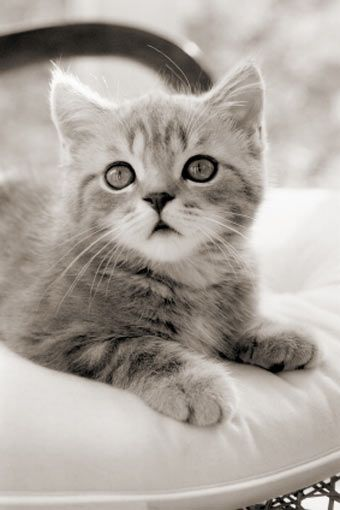
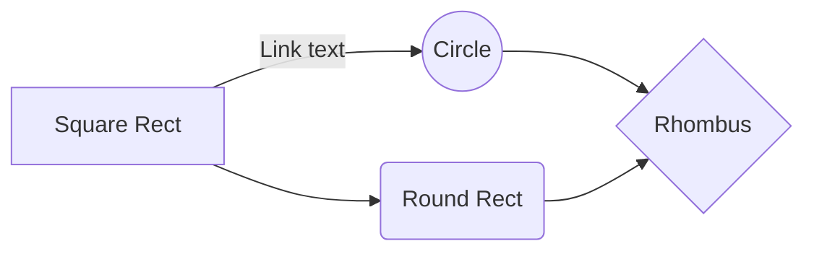

# TODO
* check to make sure there’s at least one doc file present other than index.md.
* Title in browser window & bookmark should include project name
* Add options:
```
--clean      # remove all generated .html, toc.conf, and styles.css files
--modified   # shows which md files have been modified and need processing
```

## Relative image 


## Subkop
Lorem ipsum dolor sit amet, consectetur adipiscing elit, sed do eiusmod tempor incididunt ut labore et dolore magna aliqua. Ut enim ad minim veniam, quis nostrud exercitation ullamco laboris nisi ut aliquip ex ea commodo consequat. Duis aute irure dolor in reprehenderit in voluptate velit esse cillum dolore eu fugiat nulla pariatur. Excepteur sint occaecat cupidatat non proident, sunt in culpa qui officia deserunt mollit anim id est laborum.


## Subkop 2
Lorem ipsum dolor sit amet, consectetur adipiscing elit, sed do eiusmod tempor incididunt ut labore et dolore magna aliqua. Donec et odio pellentesque diam volutpat commodo. Pellentesque elit eget gravida cum sociis natoque penatibus et. Nunc mi ipsum faucibus vitae aliquet. Venenatis urna cursus eget nunc scelerisque. Ut consequat semper viverra nam libero justo laoreet sit. Cras pulvinar mattis nunc sed blandit libero volutpat sed. Eleifend mi in nulla posuere sollicitudin aliquam. Sit amet dictum sit amet justo donec enim diam. Enim tortor at auctor urna nunc id. Egestas quis ipsum suspendisse ultrices gravida dictum fusce ut placerat. Egestas sed sed risus pretium quam vulputate dignissim suspendisse. Orci phasellus egestas tellus rutrum tellus pellentesque eu. Tempus quam pellentesque nec nam aliquam sem et tortor consequat. Scelerisque viverra mauris in aliquam sem fringilla. Curabitur vitae nunc sed velit. Odio pellentesque diam volutpat commodo sed egestas egestas fringilla. Sed cras ornare arcu dui. Libero id faucibus nisl tincidunt eget nullam. Proin fermentum leo vel orci porta non pulvinar neque laoreet.

## Mermaid example




## Code example
```html
<!DOCTYPE html>
<html>
<head>
	...
	<link href="themes/prism.css" rel="stylesheet" />
</head>
<body>
	...
	<script src="prism.js"></script>
</body>
</html>
```

```js
// Create reference instance
var myMarked = require('marked');

// Get reference
var renderer = new myMarked.Renderer();

// Override function
renderer.heading = function (text, level) {
  var escapedText = text.toLowerCase().replace(/[^\w]+/g, '-');

  return `
          <h${level}>
            <a name="${escapedText}" class="anchor" href="#${escapedText}">
              <span class="header-link"></span>
            </a>
            ${text}
          </h${level}>`;
};

// Run marked
console.log(myMarked('# heading+', { renderer: renderer }));
```

## More text

Sit amet porttitor eget dolor. Eget lorem dolor sed viverra ipsum nunc aliquet bibendum enim. Amet aliquam id diam maecenas ultricies mi eget. Tincidunt lobortis feugiat vivamus at augue eget. Diam quis enim lobortis scelerisque fermentum dui faucibus in. Molestie a iaculis at erat pellentesque adipiscing commodo. Vitae auctor eu augue ut lectus. Tortor dignissim convallis aenean et tortor at risus viverra adipiscing. Enim sed faucibus turpis in eu. Eget gravida cum sociis natoque. Sit amet consectetur adipiscing elit pellentesque. Arcu cursus vitae congue mauris rhoncus aenean vel elit. Proin sed libero enim sed faucibus turpis in eu. Elit pellentesque habitant morbi tristique.

Euismod lacinia at quis risus sed vulputate odio ut. Urna duis convallis convallis tellus id interdum velit laoreet id. Mauris pharetra et ultrices neque ornare aenean. In pellentesque massa placerat duis. Pretium lectus quam id leo in vitae. Et malesuada fames ac turpis egestas sed tempus urna. Et netus et malesuada fames ac turpis egestas sed tempus. Etiam dignissim diam quis enim lobortis. Ultricies lacus sed turpis tincidunt. Leo vel orci porta non pulvinar. Fames ac turpis egestas integer eget aliquet nibh praesent.

Facilisis magna etiam tempor orci eu lobortis elementum nibh. Sem et tortor consequat id porta. Aliquam vestibulum morbi blandit cursus risus at ultrices mi. Amet purus gravida quis blandit turpis cursus in hac. Turpis tincidunt id aliquet risus feugiat in. Auctor eu augue ut lectus arcu bibendum at. Id diam vel quam elementum pulvinar etiam non quam. Consectetur purus ut faucibus pulvinar elementum integer. Vestibulum mattis ullamcorper velit sed ullamcorper morbi tincidunt ornare massa. Ridiculus mus mauris vitae ultricies leo integer malesuada.

Viverra orci sagittis eu volutpat odio facilisis. Venenatis lectus magna fringilla urna porttitor. Cras fermentum odio eu feugiat pretium nibh ipsum consequat. Enim eu turpis egestas pretium. Praesent elementum facilisis leo vel fringilla. A cras semper auctor neque vitae tempus quam pellentesque. Urna neque viverra justo nec. Et tortor consequat id porta nibh venenatis cras. Venenatis tellus in metus vulputate eu scelerisque felis imperdiet. Dui sapien eget mi proin sed libero enim. Sed sed risus pretium quam vulputate dignissim suspendisse in. Sed lectus vestibulum mattis ullamcorper velit sed ullamcorper morbi tincidunt. Eget nunc lobortis mattis aliquam faucibus purus. Ornare lectus sit amet est.